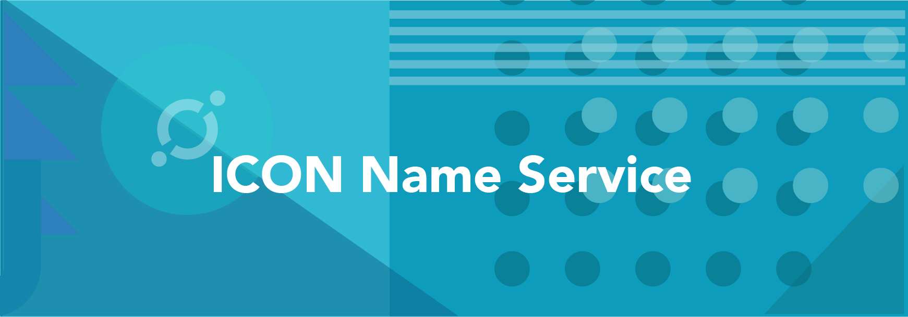

> 📖🔍 Documents and implementations for the ICON Name Service.

## 💡 What is ICON?
ICON is building a massive platform that will allow various blockchains to interact with each other via smart contracts.  Existing within what developers brand the ICON Republic, communities will connect with each other using ICON’s loopchain technology.

## 💡 What is BNS?
BNS – or blockchain name system – is the protocol on the internet that turns human-comprehensible decentralized website names such as ‘website.icx’ or ‘mywebsite.eth’ into addresses understandable by decentralized network machines.

## 📝 Description

INS is the ICON Name Service, a distributed, open, and extensible naming system based on the ICON blockchain.

## 📚 Documents

#### Table of Contents
-  [Introduction](./docs/INTRODUCTION.md)
-  [Implementation](./docs/IMPLEMENTATION.md)
    - [Registry](./docs/REGISTRY.md)
    - [Registrar](./docs/REGISTRAR.md)
    - [Resolver](./docs/RESOLVER.md)
    - [ReverseRegistrar](./docs/REVERSE_REGISTRAR.md)
-  [Developer Guide](./docs/DEVELOPER_GUIDE.md)
-  [Integration](./docs/INTEGRATION.md)

## 📝 Guideline
- [Tutorial](./docs/TUTORIAL.md)

## #️⃣ Reference
- [IIP6](https://github.com/icon-project/IIPs/blob/master/IIPS/iip-6.md) - ICON Name Service Standard

## 📣 Contributing
See [CONTRIBUTING.md](./CONTRIBUTING.md) for how to help out.

## 🗒 Licence
See [LICENSE](./LICENSE) for details.
