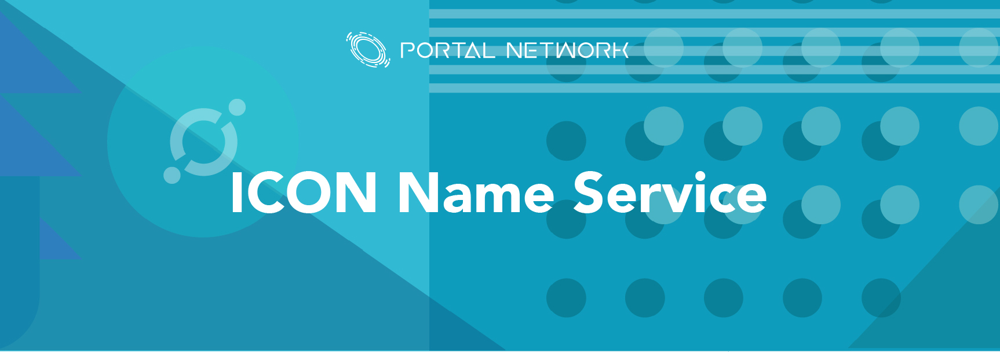
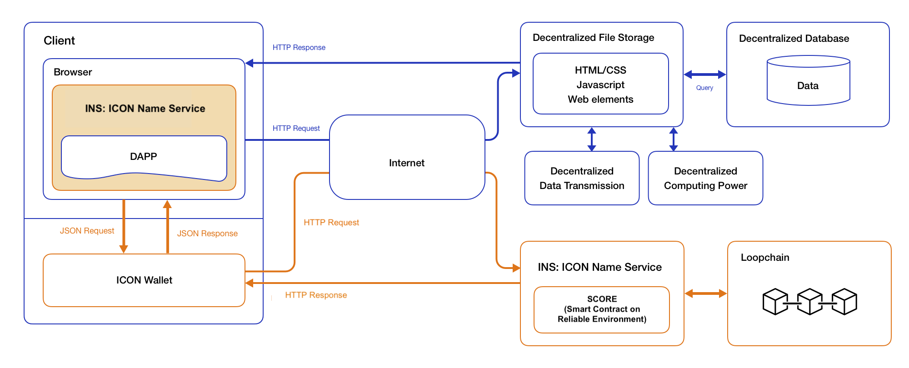
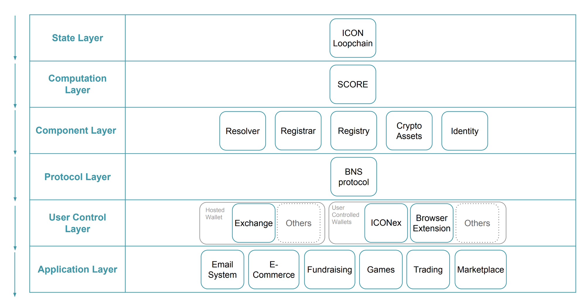
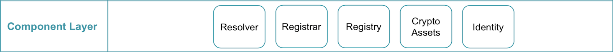
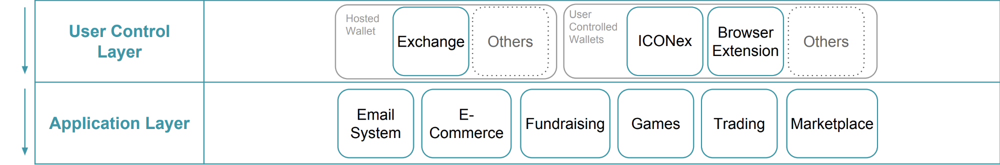

> 📖🔍 Documents and implementations for the ICON Name Service.

## 💡 What is ICON?
ICON is building a massive platform that will allow various blockchains to interact with each other via smart contracts.  Existing within what developers brand the ICON Republic, communities will connect with each other using ICON’s loopchain technology.

## 💡 What is BNS?
BNS – or blockchain name system – is the protocol on the internet that turns human-comprehensible decentralized website names such as ‘website.icx’ or ‘mywebsite.eth’ into addresses understandable by decentralized network machines.

## 📝 Description

INS is the ICON Name Service, a distributed, open, and extensible naming system based on the ICON blockchain.

## 📚 Documents

#### Table of Contents
- [Introduction](./docs/INTRODUCTION.md)
- [Implementation](./docs/IMPLEMENTATION.md)
    - [Registry](./docs/REGISTRY.md)
    - [Registrar](./docs/REGISTRAR.md)
    - [Resolver](./docs/RESOLVER.md)
    - [ReverseRegistrar](./docs/REVERSE_REGISTRAR.md)
- [Developer Guide](./docs/DEVELOPER_GUIDE.md)
- [Integration](./docs/INTEGRATION.md)
- [Spec](./ins/SPEC.md)

## 📝 Guideline
- [Tutorial](./docs/TUTORIAL.md)
- [T-bears](./docs/T-BEARS.md)
- [STEP](./docs/STEP.md)

## INS Workflow

## 🗂️ INS Stack

### State Layer
State layer is where user’s “state”, or user’s information and behavior, is stored. For ICON, Loopchain is where these data are stored, and gives users the ability to control their own state.

### Computation Layer
Computation layer is where SCORE executes complicated calculations. It is an environment for smart contracts on ICON to be checked and managed, just like how EVM (Ethereum Virtual Machine) manages smart contract on Ethereum. When a transaction occurs on ICON, the logic designed in SCORE will determine its path that cannot be altered. Portal Network will be deploying INS (SCORE) on this layer that consists 3 major components.

### Component Layer
With the combination of state layer and computation layer, many things could be implemented in the component layer. INS for instance, consists 3 major components — registrar, registry and resolver. These components make sure that INS is operable and could meet the specific needs of each individual.

### Protocol Layer
On the Protocol Layer, we will be presenting our BNS (Blockchain Name Service) standards that can make the INS more efficient and applicable. With the state, computation and component layers behind the scene, protocol layer serve as a gateway for users and developers to interact with our INS standard.

### User Control Layer
User control layer is in charge of managing private keys to communicate with the state layer. INS empowers users to control, set up and manage their digital asset with an easier and readable text. This enables more use cases around INS at the application layer. For example, our Web Builder let users to create their own decentralized websites (DWebs) binded with an INS, and a further enhancement on our extension could be used to access these DWebs with ease at “yourwebsite.icon”.

### Application Layer
INS can be implemented into many other applications on ICON platform, such as wallet that can resolve INS, dApp that utilize INS for users identity and many more. We believe that it is an essential components to provide a better environment for both technical and non-technical users.

## #️⃣ Reference
- [IIP6](https://github.com/icon-project/IIPs/blob/master/IIPS/iip-6.md) - ICON Name Service Standard

## 📣 Contributing
See [CONTRIBUTING.md](./CONTRIBUTING.md) for how to help out.

## 🗒 Licence
See [LICENSE](./LICENSE) for details.
