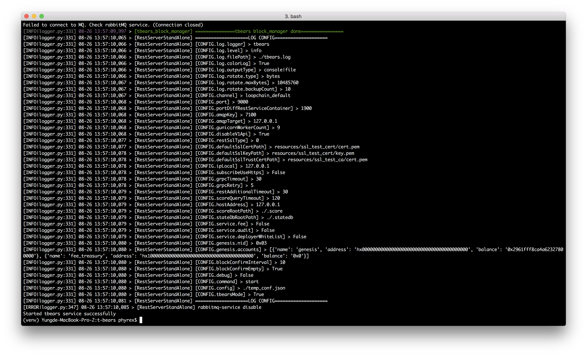

# Tutorial

This tutorial shows how you start an ICON testnet for development.

## Architecture Overview


## Requirement

Python 3.6, install here: https://www.python.org/downloads/release/python-366/

## Install Dependency

To start ICON and use SCORE to develop, we have to install the following projects and libraries.

### Install LevelDB 
```
brew install leveldb
```

### Install RabbitMQ
```
brew install rabbitmq
```

### Install Other tools
```
brew install automake
brew install pkg-config
brew install libtool
brew install libffi
brew install gmp
```

### Create a folder for the service
```
mkdir icon
cd icon
```

### Install ICON Service
- icon-service: ICON Service for python
```
git clone https://github.com/icon-project/icon-service.git
```

#### Building source
```
virtualenv -p python3 venv  # Create a virtual environment.
source venv/bin/activate    # Enter the virtual environment.
./build.sh                  # run build script
pip install iconservice
```

### Install ICON Commons
- icon-commons: ICON commmon package for python
```
git clone https://github.com/icon-project/icon-commons.git
```

#### Building source
```
virtualenv -p python3 venv  # Create a virtual environment.
source venv/bin/activate    # Enter the virtual environment.
./build.sh                  # run build script
pip install iconcommons
```

### Install ICON RPC Server
- icon-rpc-server: ICON RPC Server
```
git clone https://github.com/icon-project/icon-rpc-server.git
```

#### Building source
```
virtualenv -p python3 venv  # Create a virtual environment.
source venv/bin/activate    # Enter the virtual environment.
./build.sh                  # run build script
pip install iconrpcserver
```

### Install t-bears
- t-bears: Test suite for ICON SCORE development
```
git clone https://github.com/icon-project/t-bears.git
```

#### Building source
```
virtualenv -p python3 venv
source venv/bin/activate
./build.sh
pip install tbears
```

## Start ICON

Start RabbitMQ for ICON Service
```
brew services start rabbitmq
```

You can find tbears commands: [HERE](https://github.com/icon-project/t-bears#how-to-use-t-bears)

```
tbears start
```



## JSON-RPC API v3

The API spec defined [HERE](https://github.com/icon-project/icon-rpc-server/blob/master/docs/icon-json-rpc-v3.md)  

Using Rest Client on VSCode, [REST API SPEC](../ins/icon.http)

## Deploy ICON contract


Using tbears command
```
tbears deploy -t tbears abc
```

Result of deploytment
```
[INFO|logger.py:331] 08-28 22:07:42,578 > [IconInnerService] pre_validate_check request with {'method': 'icx_sendTransaction', 'params': {'version': '0x3', 'from': 'hxaaaaaaaaaaaaaaaaaaaaaaaaaaaaaaaaaaaaaaaa', 'value': '0x0', 'stepLimit': '0x300000', 'timestamp': '0x5747f5d899c02', 'nid': '0x3', 'nonce': '0x1', 'to': 'cx0000000000000000000000000000000000000000', 'data': {'contentType': 'application/tbears', 'content': '/Users/phyrex/Documents/git/icon-project/t-bears/abc', 'params': {}}, 'dataType': 'deploy', 'signature': 'sig'}}
[INFO|logger.py:331] 08-28 22:07:42,597 > [IconInnerService] pre_validate_check response with 0x0
Send deploy request successfully.
If you want to check SCORE deployed successfully, execute txresult command
transaction hash: 0x3e211657e213dbc40bfe898eae1ba7f4e9e59ba36bb2af52c51b6bd2a712511a
```

Check transaction result
```
tbears txresult 0x3e211657e213dbc40bfe898eae1ba7f4e9e59ba36bb2af52c51b6bd2a712511a
```

Result of transaction hash
```
Transaction result: {
    "jsonrpc": "2.0",
    "result": {
        "txHash": "0x3e211657e213dbc40bfe898eae1ba7f4e9e59ba36bb2af52c51b6bd2a712511a",
        "blockHeight": "0x28d",
        "blockHash": "0x8131d068ccbdeedb36c78773c9e60b2ffd671c098c4a833006708cec7c031aa7",
        "txIndex": "0x0",
        "to": "cx0000000000000000000000000000000000000000",
        "scoreAddress": "cx6bd390bd855f086e3e9d525b46bfe24511431532",
        "stepUsed": "0x12e58",
        "stepPrice": "0x0",
        "cumulativeStepUsed": "0x12e58",
        "eventLogs": [],
        "logsBloom": "0x00000000000000000000000000000000000000000000000000000000000000000000000000000000000000000000000000000000000000000000000000000000000000000000000000000000000000000000000000000000000000000000000000000000000000000000000000000000000000000000000000000000000000000000000000000000000000000000000000000000000000000000000000000000000000000000000000000000000000000000000000000000000000000000000000000000000000000000000000000000000000000000000000000000000000000000000000000000000000000000000000000000000000000000000000000000",
        "status": "0x1"
    },
    "id": 1
}
```

Check SCORE api
```
tbears scoreapi cx6bd390bd855f086e3e9d525b46bfe24511431532
```

Result of SCORE api
```
[INFO|logger.py:331] 08-28 22:16:13,699 > [IconInnerService] invoke response with {'txResults': {}, 'stateRootHash': 'a7ffc6f8bf1ed76651c14756a061d662f580ff4de43b49fa82d80a4b80f8434a'}
[INFO|logger.py:331] 08-28 22:16:13,702 > [IconInnerService] write_precommit_state request with {'blockHeight': '0x2c1', 'blockHash': 'ffd83e2be01ce73d2275ba2c5952dfe0f28ba3a66967f919f890259f269d9330'}
[INFO|logger.py:331] 08-28 22:16:13,702 > [IconInnerService] write_precommit_state response with 0x0

[INFO|logger.py:331] 08-28 22:16:16,168 > [IconInnerService] query request with {'method': 'icx_getScoreApi', 'params': {'address': 'cx6bd390bd855f086e3e9d525b46bfe24511431532'}}
[INFO|logger.py:331] 08-28 22:16:16,169 > [IconInnerService] query response with [{'type': 'fallback', 'name': 'fallback', 'inputs': []}, {'type': 'function', 'name': 'hello', 'inputs': [], 'outputs': [{'type': 'str'}], 'readonly': '0x1'}]
SCORE API: [
    {
        "type": "fallback",
        "name": "fallback",
        "inputs": []
    },
    {
        "type": "function",
        "name": "hello",
        "inputs": [],
        "outputs": [
            {
                "type": "str"
            }
        ],
        "readonly": "0x1"
    }
]
```

Create call.json for method information
```
vi call.json

{
  "jsonrpc": "2.0",
  "method": "icx_call",
  "params": {
    "from": "hxef73db5d0ad02eb1fadb37d0041be96bfa56d4e6",
    "to": "cx6bd390bd855f086e3e9d525b46bfe24511431532",
    "dataType": "call",
    "data": {
      "method": "hello"
    }
  },
  "id": 1
}
```

Call a SCORE method
```
tbears call call.json
```

Call Result
```
response : {
    "jsonrpc": "2.0",
    "result": "Hello",
    "id": 1
}
```

